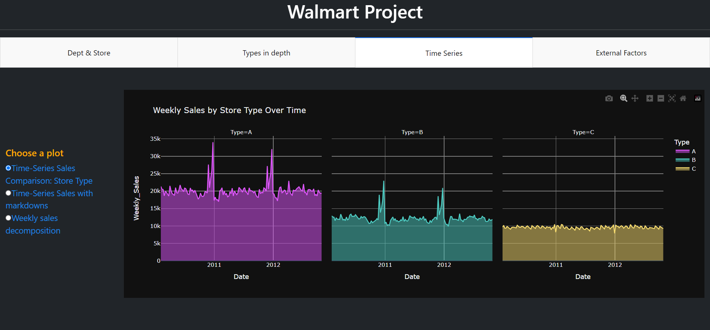
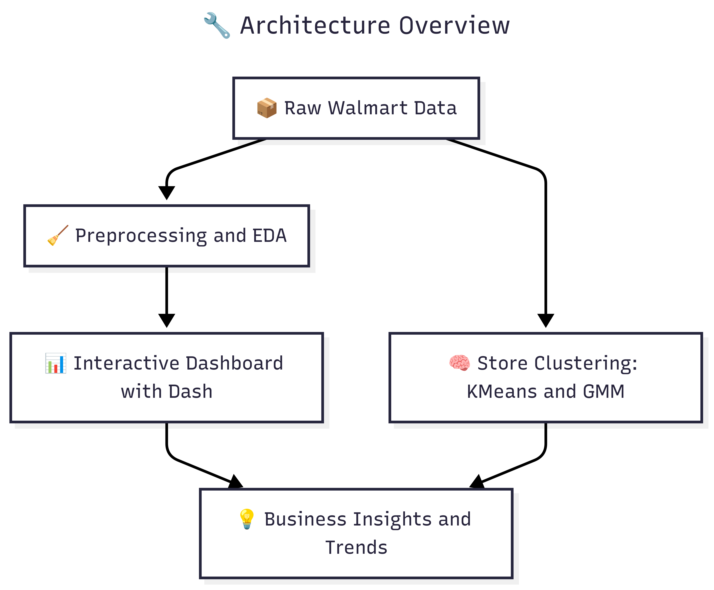

# 🛒 Walmart Sales Dashboard

[](https://walmart-dataset-analysis.onrender.com/)
[](https://www.kaggle.com/datasets/yasserh/walmart-dataset)
[](LICENSE)
[](https://plotly.com/dash/)
[](https://mermaid.js.org/)

An interactive dashboard exploring sales across Walmart stores and departments. Analyze store types, department performance, holiday effects, and more using machine learning clustering techniques.

## ✨ Features
- 🧩 Interactive Plotly Dash visualizations  
- 🧠 K-Means & GMM clustering on store/department features  
- 📊 Sales breakdown by store type, department, and external factors  
- 🚀 Dockerized deployment on Render
- 📈 Time series analysis and economic correlations

---
## Dashboard Sample


## 🧰 Tech Stack

| Layer           | Tools & Technologies                                               |
|----------------|---------------------------------------------------------------------|
| 📊 Visualization | Plotly, Dash                                                      |
| 🧠 ML Models     | Scikit-learn (KMeans, GMM), pandas, NumPy                          |
| 🐋 Deployment    | Docker, Render                                                     |
| 📦 Backend Code  | Modular Python scripts (data loader, backend logic, constants)     |
| 🧱 Architecture  | Multi-file structure with user controls, graph tabs, layout logic  |
| 📈 Dashboard UI  | Interactive tabs, radio buttons, modular callbacks                 |
| 🧪 EDA & Stats   | Correlation, Time Series, Markdown impact analysis, clustering     |


---
## 📌 Project Highlights

### Architecture Overview
  
*Data pipeline from raw inputs to business insights*

### 🗂️ Project Structure

<pre>
├── .gitignore
├── requirements.txt
├── Dockerfile
├── main.py                # App entry point
├── src/
│   ├── backend_code/      # Core business logic
│   │   ├── constants.py
│   │   ├── data_loader.py
│   │   ├── tab_code/      
│   ├── user_choices/        
│   ├── graph_elements/    # Visualization modules
│   ├── layout.py          # Dashboard structure
│   ├── ids.py             # Component ID registry
</pre>

### System Sequence
  
*User interaction flow through dashboard components*

---


**Description:** As one of the leading retail giants in the US, Walmart aims to accurately predict sales and demand. Events and holidays can affect daily sales. With 45 Walmart stores' sales data at hand, the challenge is dealing with unforeseen demands and stockouts due to less-than-optimal machine learning models. An ideal model should account for economic indicators like the CPI and Unemployment Index.

Prominent holidays like the Super Bowl, Labour Day, Thanksgiving, and Christmas affect sales. In the evaluation, holiday weeks are given 5x weightage. Part of this challenge is factoring in the effects of promotional markdown events, especially during these holiday weeks, despite incomplete historical data.

**Acknowledgements:** The dataset originates from [Kaggle](https://www.kaggle.com/datasets/yasserh/walmart-dataset).

---
## 📈 Department Sales Insights

Understanding department-level performance reveals hidden patterns in consumer behaviour, especially around holidays. The plots in the dashboard contrast holiday vs non-holiday sales and spotlight the five best and worst departments for each major event.

### 🧾 Performance Overview (Top vs Bottom)

| Metric | Holiday | Non-Holiday | Notes |
|--------|---------|-------------|-------|
| **Leader** | **Dept 92** 🔥 | **Dept 92** 📋 | Consistently #1, but Christmas sales (~48 k) dip vs 60 k+ on other holidays |
| **Runner-ups** | 38, 95, 90 | 38, 95, 90 | Strong all-rounders, slightly holiday-weighted |
| **Bottom-end** | 4, 96, 40 | 2, 96, 40 | Persistent low performers, minimal holiday uplift |

### 🟠 Holiday vs Non-Holiday Highlights

* **Dept 92 dominates** every timeframe; its Christmas revenue is still #1 but noticeably lower than its own Super Bowl/Thanksgiving peaks.  
* **Depts 38 & 95** show robust, balanced sales, making them reliable revenue generators.  
* **Depts 4, 2, 96, 40** hover at the tail regardless of season, signalling inventory or demand issues.


### 🎯 Top-5 Departments Across Holidays

| Holiday      | Rank #1 | Rank #2 | Rank #3 | Rank #4 | Rank #5 |
|--------------|---------|---------|---------|---------|---------|
| **Super Bowl** | 92 | 38 | 95 | 90 | 91 |
| **Labor Day**  | 92 | 95 | 38 | 90 | 94 |
| **Thanksgiving** | 92 | 90 | 95 | 38 | 94 |
| **Christmas** | 92 | 38 | 95 | 90 | 94 |

*Takeaway*: **Dept 92 is holiday-agnostic**—it leads every time. Depts 38 & 95 are close contenders, while Dept 90 jumps to #2 at Thanksgiving.

### 🧊 Bottom-5 Departments Across Holidays

| Holiday      | Lowest 5 Depts (worst → better) |
|--------------|---------------------------------|
| **Super Bowl** | 55, 44, 26, 49, 41 |
| **Labor Day**  | 99, 41, 44, 24, 33 |
| **Thanksgiving** | 22, 33, 26, 41, 20 |
| **Christmas** | 44, 24, 49, 33, 34 |

*Key Insight*: **Dept 44 appears in the bottom tier for all holidays**, suggesting chronic underperformance, whereas other laggards rotate by event.

### 💡 Business Implications

1. **Re-stock & price-optimise Dept 92** for Christmas—it under-delivers relative to its own holiday ceiling.  
2. **Promote or diversify Depts 4, 2, 96, 40**; their demand is weak even in peak seasons.  
3. **Investigate Dept 44** (bottom across all holidays) for assortment, placement, or pricing misalignment.  
4. **Leverage Depts 38 & 95** as stable anchors in promotional bundles—they thrive in both routine and holiday periods.

---
## 📈 Store Sales Insights


### Walmart Store Comparative Analysis:

| Features         | 🅰️ Supercenter                                              | 🅱️ Discount Store                                | 🅲 Neighborhood Market                               |
|------------------|----------------------------------------------------------|------------------------------------------------|--------------------------------------------------|
| **Founded In**   | 1988                                                     | 1962                                           | 1998                                               |
| **Size**         | 182,000 sq ft                                            | 106,000 sq ft                                  | 38,000 sq ft                                       |
| **Key Products** | Grocery, electronics, apparel, home decor, fresh produce | Electronics, apparel, home decor, health/beauty| Pharmacy, groceries, fresh produce, dairy, bakery |
| **Unique Features**| 24/7 ops; Potential for banks, salons, etc.           | Spacious, well-lit ambiance                   | -                                                  |

_[Source](https://corporate.walmart.com/about)_

### 🏆 Store Performance Overview

| Category                   | Stores               |
| -------------------------- | -------------------- |
| 🌟 **Top Performers**      | 20, 4, 14, 10, 2, 13 |
| 🏈 **Super Bowl Leaders**  | 20, 4                |
| 🇺🇸 **Labor Day Leaders** | 14, 20               |
| 📉 **Lowest Performers**   | 33, 5                |

💡 **Insight**: Stores 20 and 14 appear **frequently across top event categories**, suggesting strong general and event-driven sales performance.


### 🏪 Store Type Distribution Summary

| Store Type | % of All Stores | Avg Weekly Sales Contribution | Thanksgiving Dip |
|------------|------------------|-------------------------------|------------------|
| Type A     | 51.2%            | 48%                           | –                |
| Type B     | 38.7%            | 29.3%                         | –                |
| Type C     | 10.1%            | 22.7%                         | Drops to 17%     |

**💡 Note:** Despite making up only 10.1% of all stores, **Type C** stores punch above their weight in weekly sales, though their performance dips slightly during major holidays.

---

## 📊 Walmart Time Series Insights  

### **Seasonal Trends**  
- **Types A & B**:  
  - 📈 Noticeable sales spikes in **November & December** (holiday season).  
  - 📉 Sharp drop in **January** (post-holiday slump).  
  - 🔄 Rebound in **February** (Groundhog Day, Valentine’s Day, etc.).  
  - 🛒 October sales dip as customers **anticipate** holiday deals.  
- **Type C**:  
  - No significant seasonal fluctuations observed.  


### **Economic Observations**  
- **Inflation & Employment**:  
  - 📈 **CPI steadily rises** (indicating inflation).  
  - 📉 **Unemployment declines** over time.  
  - 🔄 Strong **inverse correlation** between CPI & unemployment (supports **Phillips Curve** on weekly data).  
- **Fuel Prices**:  
  - ⛽ **Direct correlation** with CPI (weekly).  
  - ⬇️ **Inverse correlation** with unemployment (weekly).  
- **Sales & Economic Factors**:  
  - ↔️ **Weak correlation weekly**, but **stronger monthly**.  


### **Difference in Means (With vs. Without Markdowns)**  
| Metric         | Difference  |  
|----------------|------------|  
| Temperature    | +1.535219  |  
| Fuel_Price     | +0.160912  |  
| CPI            | +4.436657  |  
| Unemployment   | **-0.745140** |  


### **Promotions & Sales**  
- At first glance, markdowns appear **ineffective or even harmful**.  
- However, **higher inflation** during the markdown period explains this trend.  


### **Economic Events Influence**  
- Major events impacted sales:  
  - 🏛️ **2012 US Presidential Election**  
  - 💸 **Great Recession (2008–2012)**  
  - 🏠 **Real Estate Crisis**  
- Despite challenges, sales **marginally increased**, demonstrating resilience.  

---  

# 🛒 Clustering Analysis

## Stores Analysis

| **Cluster** | **Stores**                                                                    | **# Stores** | **Sales (USD)** | **Key Insights**                                                           |
| ----------- | ----------------------------------------------------------------------------- | ------------ | --------------- | -------------------------------------------------------------------------- |
| **0**       | 1, 2, 4, 6, 8, 10, 11, 13, 14, 20, 31, 39                                     | 12           | **\$88.4M**     | Highest sales, highest markdowns, 2nd highest CPI, **lowest unemployment** |
| **1**       | 7, 15, 16, 17, 18, 19, 22, 23, 24, 25, 26, 27, 29, 32, 34, 35, 40, 41, 44, 45 | 20           | **\$50.0M**     | 2nd in sales, consistent performance, balanced economic factors            |
| **2**       | 12, 28, 33, 38, 42                                                            | 5            | **\$37.1M**     | High fuel prices, **highest unemployment**, economic sensitivity           |
| **3**       | 3, 5, 9, 21, 30, 36, 37, 43                                                   | 8            | **\$25.4M**     | **Lowest sales**, lowest markdowns, **highest CPI**                        |

**📌 Note:** Cluster segmentation is based on store performance, markdown behavior, and local economic conditions (CPI, Fuel Price, Unemployment).


## 🛒 Departments Analysis


| **Cluster** | **Departments**                                                | **# Depts** | **Sales (USD)**   | **Key Insights**                                                           |
| ----------- | -------------------------------------------------------------- | ----------- | ----------------- | -------------------------------------------------------------------------- |
| **0**       | 38, 40, 67, 72, 74, 79–99                                      | 22          | **\$60.8M**       | Highest sales, least markdowns, **dominant in count**, highest CPI         |
| **1**       | 43, 65, 77, 78                                                 | 4           | **\$572K**        | **Lowest sales**, highest markdowns, highest unemployment                  |
| **2**       | 1–14, 16–20, 21–31, 32–37, 39, 41, 42, 44–52, 54–56, 58–60, 71 | 55          | **\$20.2M (avg)** | Balanced profile, similar trends to Cluster 0, average economic indicators |


**📌 Note:** Fuel price remained consistent across all department clusters.

---

## 🛠️ Setup Instructions

To run this project locally:

### 🐍 Run with pip

```bash
# Clone the repository
git clone https://github.com/your-username/walmart-dashboard.git
cd walmart-dashboard

# Create virtual environment
python -m venv venv
source venv/bin/activate  # On Windows use `venv\Scripts\activate`

# Install dependencies
pip install -r requirements.txt

# Run the app
python main.py
```

---

## 📌 Future Work & TODOs

- 🧠 Implement time series forecasting for weekly sales
- 📈 Add ARIMA/LSTM comparisons for time-based modeling
- 🔧 Add CI/CD for auto-deployment on new commits

---

## 🤝 Contributing

Pull requests are welcome! If you spot a bug or have a feature idea:

1. Open an issue to discuss it first  
2. Fork the repo and create your feature branch  
3. Submit a PR with a clear explanation of the changes  

Please ensure your code follows the existing style and naming conventions.

---

## ⚖️ License

This project is licensed under the **MIT License** — feel free to use, modify, and distribute it.  
See the [LICENSE](./LICENSE) file for details.
